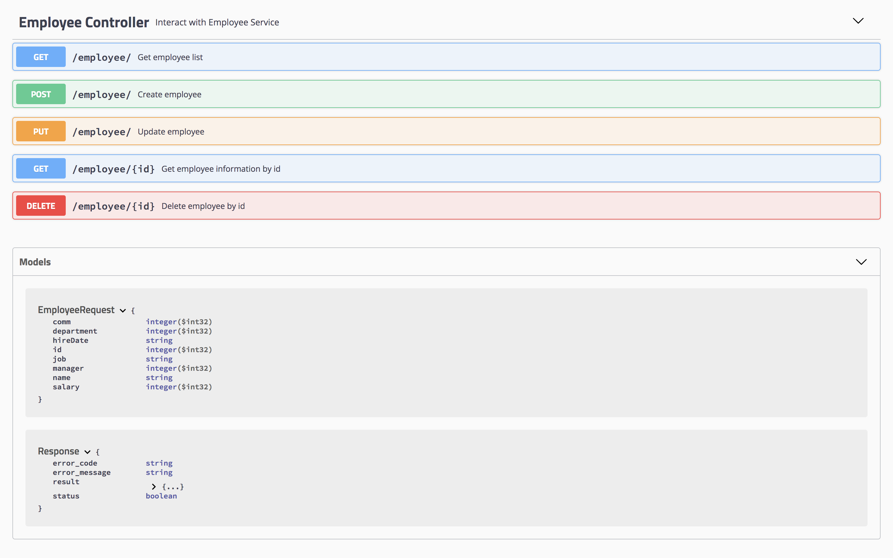

# Spring Boot ORDS Boilerplate

## 🚀Overview
**Spring Boot ORDS Boilerplate** is the middle ware provide API gateway and connect ORDS to fetch data from Oracle Database.

## 📚Table of Content
- [Technical Stack](#technical-stack)
- [Prerequisite](#prerequisite)
- [Include Third Party Library](#include-third-party-library)
- [Build and Run](#build-and-run)
- [Folder Structure](#folder-structure)
- [Generate Java Doc](#generate-java-doc)
- [Run ORDS by Docker](#run-ords-by-docker)
- [Reference](#reference)

## 🔨<a name="technical-stack"></a>Technical Stack
- Spring framework
- Java 8
- Maven 3

## 🔗<a name="prerequisite"></a>Prerequisite
- [ORDS Adapter Boilerplate](https://github.com/PhyrexTsai/ords-adapter-boilerplate): Please make sure to follow the step to generate `jar` file and follow the instruction before you run **Spring Boot ORDS Boilerplate**

## 📥<a name="include-third-party-library"></a>Include Third Party Library
Before we run **Spring Boot ORDS Boilerplate**, please make sure that you have already 
compile the `ords-adapter-boilerplate-1.0.0.jar` then put it under `/src/resources` and 
remember updating the `pom.xml` to include the dependency

## 🏗<a name="build-and-run"></a>Build and Run

STEP 1. Install dependancy
```
mvn install
```

STEP 2. Build war file
```
mvn clean package
```

STEP 3. Run on localhost
Run local by `mvnw`, will start on [http://localhost:8081](http://localhost:8081)
```
./mvnw clean package && java -jar target/spring-boot-ords-boilerplate-1.0.0.war
```

STEP 4. View Swagger UI
Open [http://localhost:8081/swagger-ui.html](http://localhost:8081/swagger-ui.html)


## 📦<a name="folder-structure"></a>Folder Structure
- aspect: Using AOP to log RESTful APIs information
- config: Define configuration, ex: swagger config
- **controller**: Define API path, accept paramter and response
- exception: Define exception
- handler: Define handler, ex: exception handler
- parameter: Define RESTful APIs parameters
- **service**: Define business logic for controller usage

## 📑<a name="generate-java-doc"></a>Generate Java Doc

STEP 1. Run the command to generate Java doc
```
mvn javadoc:javadoc
```

STEP 2. Open Java doc  
Open `target/site/apidocs/index.html`, it will show Java doc as well

## 💡<a name="run-ords-by-docker">Run ORDS by Docker
STEP 1. Clone Repository    
Clone [https://github.com/PhyrexTsai/docker-db-apex-dev/](https://github.com/PhyrexTsai/docker-db-apex-dev/) and run the step by on `README.md`  

STEP 2. Launch Instance  
Execute SQL and launch API by following [https://github.com/PhyrexTsai/docker-db-apex-dev/blob/master/ORDS.md](https://github.com/PhyrexTsai/docker-db-apex-dev/blob/master/ORDS.md)

## 🗒<a name="reference"></a>Reference
- Pack exteranl jar: https://medium.com/@webber.cheng/spring-boot-%E6%89%93%E5%8C%85-external-jar-%E8%A7%A3%E6%B1%BA%E6%96%B9%E6%A1%88-292d6e800df5
- JSON Object mapping: https://www.baeldung.com/jackson-object-mapper-tutorial
- JSONPath: https://www.itread01.com/content/1543681863.html
